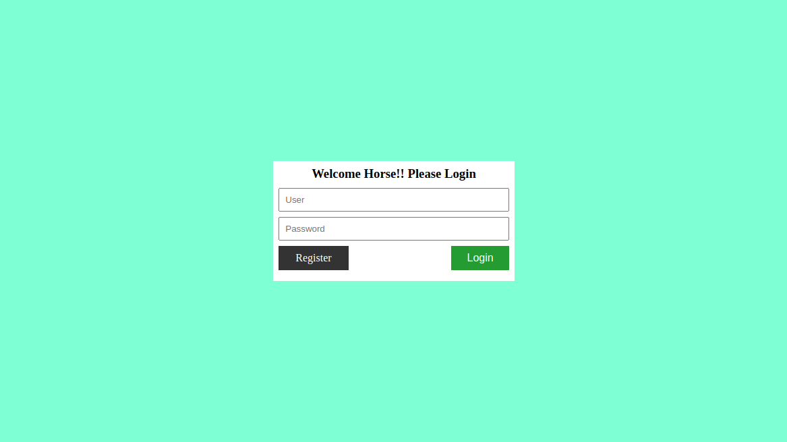

# php_login_system

# Deploying

Clone projec into your web root
Create database called test_db

execute the following sql queries

--
-- Table structure for table `users`
--

CREATE TABLE `users` (
  `id` int(11) NOT NULL,
  `user_name` varchar(255) NOT NULL,
  `password` varchar(255) NOT NULL,
  `name` varchar(255) NOT NULL,
  `created_date` timestamp NOT NULL DEFAULT current_timestamp(),
  `last_logged_in` text NOT NULL,
  `last_logged_out` text NOT NULL
) ENGINE=InnoDB DEFAULT CHARSET=latin1;

--
-- Dump

--
-- Indexes for table `users`
--
ALTER TABLE `users`
  ADD PRIMARY KEY (`id`);

--
-- AUTO_INCREMENT for dumped tables
--

--
-- AUTO_INCREMENT for table `users`
--
ALTER TABLE `users`
  MODIFY `id` int(11) NOT NULL AUTO_INCREMENT, AUTO_INCREMENT=6;
COMMIT;
